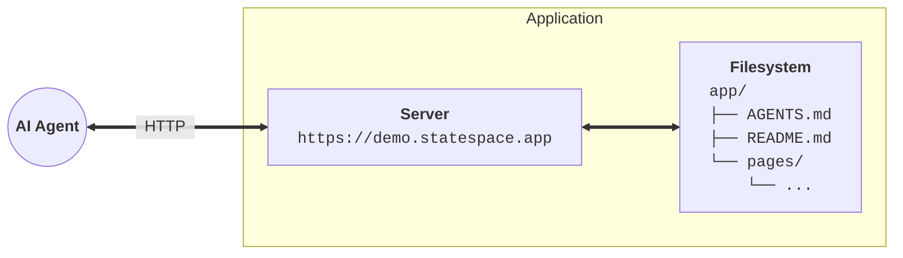

# Diagram

```mermaid
graph LR
    A(("<b>AI Agent</b>")) <===>|&nbsp;&nbsp;HTTP&nbsp;&nbsp;| B

    subgraph Application
        B["<b>Server</b><br/><code>https://demo.statespace.app</code>"] <===> C["<b>Filesystem</b><br/><code style='text-align:left;display:block'>app/<br/>├── AGENTS.md<br/>├── README.md<br/>└── pages/<br/>&nbsp;&nbsp;&nbsp;&nbsp;└── ...</code>"]
    end
```
